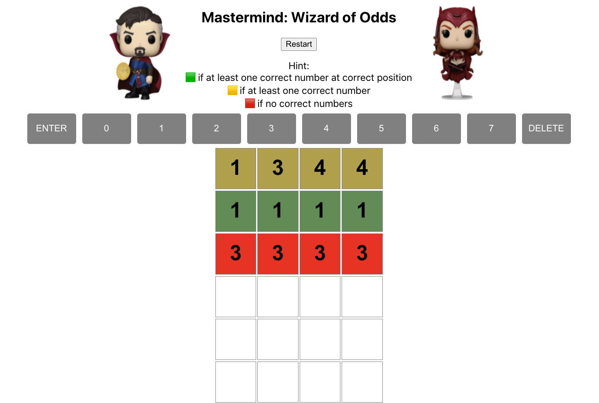

# linkedIn-REACH

Overview: This is a mastermind game that is built using React and random integer api. 
React provides a powerful tool that allows auto rendering as well as the power to
update only the necessary nodes. React uses virtual DOM to avoid re-rendering the
whole tree. Game functionalities include keydown event listener to allow users to 
type their guess. The random integer api was used to generate a random 4 digits 
number. Additional interface features like restart and game result display when users 
lost or won are included to create a great user experience and interface. The goal
of the game is to have users making educated guess based of the hints that are 
provided from each guess. Each game, a user has 10 tries to guess the right number. 

Prerequisite:
1. install node(if not yet installed): https://nodejs.dev/learn/how-to-install-nodejs

To run the app:
### `cd wizard-of-odds`
### `npm install`
### `npm run start`
### `Open a browser(Chrome) and type localhost:3000`

Potential Extensions:
1. Modify the level by allowing user to select the number of digits that they want to play(4-8 digits)
2. Modify the level by allowing user to select the number of tries that they want to have(10-15 tries)
3. Add timer per game

Please free to contact me if there is any issues. 
Contact: lyhourlay1@gmail.com

